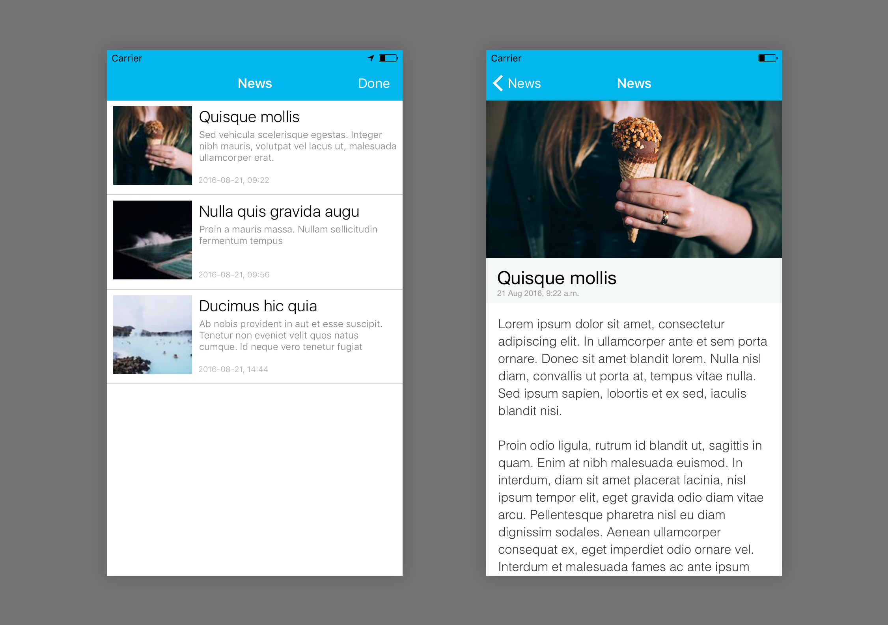

# Appwoodoo iOS SDK

`v3.0.0`

Send push messages or remotely configure your app without resubmitting it to Google Play or the App Store. Conduct A/B tests or control any behaviour from the air. **We give you the server and awesome open source SDKs.**

## What's new?

* Initial StoryWall feature

## Try it out first

You can find an example applications in the 'Example' folder. Open it with XCode and run it on any device to test push notifications, or on a Simulator to see all other features. This app is for testing out Appwoodoo - simply register on the website, get an API key, and check what remote settings are available for your app.

   

## Installation with CocoaPods

Appwoodoo uses [Cocoa Pods](https://cocoapods.org/) to install and manage dependencies. See the [Getting started](https://guides.cocoapods.org/using/getting-started.html) section for more details.

### Podfile

```ruby
platform :ios, '8.0'
use_frameworks!

target 'Example' do
  pod 'Appwoodoo', '~> 3.0.0'
end
```

## Integrating the SDK

### Quick start

The best way is to download our Example app. You are going to need your Appwoodoo `APP Key`, please find this on [your app's settings page](http://www.appwoodoo.com/woodoo/apps/) (you may need to [sign up first](http://www.appwoodoo.com/)). Once you have it, paste it to the Example application's `AppDelegate.m` file.

```objective-c
NSString *const APPKey = @"<INSERT_YOUR_APP_KEY_HERE>";
```

Don't forget to add some `Remote settings` while you're on the application's page as well. To retrieve these settings in the app, you can choose between the following options.

#### 1. TakeOff with notification observer

Every single time, when Appwoodoo downloaded your settings, it automatically fires an event called `"WoodooArrived"`, which you can listen to like this:

```objective-c
[[NSNotificationCenter defaultCenter] addObserver:self selector:@selector(onWoodooArrived:) name:@"WoodooArrived" object:nil];
```

You can ask Appwoodoo to download your settings with the following command. You have to change `<YOUR_APP_KEY>` to your App key.

```objective-c
[Woodoo takeOff:<YOUR_APP_KEY>];
```

Don't forget to implement the notification handler as well. Once your settings are downloaded, you can access them with the `[Woodoo getSettings]` call.


```objective-c
/**
* Appwoodoo downloaded your settings - notification handler
*/

- (void)onWoodooArrived:(NSNotification *)notification {
// Do something with your settings.
}
```

#### 2. TakeOff with callback method

The other option is to set a callback method, which Appwoodoo will call once it finished downloading. You can use it like below. Of course, you have to change `<YOUR_APP_KEY>` to your App key here, too.

```objective-c
[Woodoo takeOff:<YOUR_APP_KEY> target:self selector:@selector(woodooCallback:)];
```

Don't forget to implement that method as well.

```objective-c
/**
* Appwoodoo downloaded your settings - callback handler
*/

- (void)woodooCallback:(id *)sender {
// Do something with your settings.
}
```

### Quick start with the StoryWall

The StoryWall feature comes with a built-in view controller. To include it in any app, use it as
any other navigation view controller. For example:

```objective-c
WoodooStoriesNavigationController *vc = [WoodooStoriesHandler woodooStoriesNavigationController];
[self presentViewController:vc animated:YES completion:nil];
```

You can edit the list of stories to appear in your app on [appwoodoo.com](http://www.appwoodoo.com/)

* `Pro Tip`: edit the colours of the table view by changing the view options:

```objective-c
// Styling the Story Wall
[WoodooStoriesHandler setViewOption:kStoryWallBackgroundColour color:foregroundColor];  
[WoodooStoriesHandler setViewOption:kStoryWallForegroundColour color:foregroundColor];  
[WoodooStoriesHandler setViewOption:kStoryWallCellTitleColour color:[UIColor blackColor]];  
[WoodooStoriesHandler setViewOption:kStoryWallCellTextColour color:[UIColor grayColor]];  
[WoodooStoriesHandler setViewOption:kStoryWallCellDateColour color:[UIColor lightGrayColor]];  
[WoodooStoriesHandler setViewOption:kStoryWallCellDividerColour color:[UIColor colorWithWhite:0.8 alpha:1.0]];  

[WoodooStoriesHandler setViewOption:kStoryWallCellHeight size:120];  

[WoodooStoriesHandler setViewOption:kStoryWallCellTitleFont font:[UIFont systemFontOfSize:20.0 weight:UIFontWeightLight]];  
[WoodooStoriesHandler setViewOption:kStoryWallCellTextFont font:[UIFont systemFontOfSize:12.0 weight:UIFontWeightLight]];  
[WoodooStoriesHandler setViewOption:kStoryWallCellDateFont font:[UIFont systemFontOfSize:10.0 weight:UIFontWeightThin]];  
```

* `Pro Tip`: You can directly access the navigation bar to set its colours

```objective-c
// Styling the Story Wall's nav bar
[vc.navigationBar setTintColor:foregroundColor];  
[vc.navigationBar setTitleTextAttributes:@{NSForegroundColorAttributeName:foregroundColor}];  
[vc.navigationBar setBarTintColor:backgroundColor];  
[vc.navigationBar setTranslucent:NO];  
```

### Push notifications

At Appwoodoo our goal is to help mobile developers to write successful applications easier, faster and more maintainable. Since enabling push notifications can be a massive pain, we implemented an easier way to solve this issue in only a couple of minutes. For details please read the detailed [documentation of Appwoodoo iOS push notification service](http://www.appwoodoo.com/help/ios-push-notifications/)

### Logging

You can turn logging on/off in Appwoodoo with the `Woodoo:setHideLogs:` call.

```objective-c
/**
* Turn Appwoodoo logging on/off
*/
[Woodoo setHideLogs:NO];
```

## About

Appwoodoo is a free service, proudly built by [Tamas Dancsi](http://www.tamasdancsi.com/) and [Richard Dancsi](http://www.wimagguc.com/).

Please feel free to contribute: push back your improvements, or just send an e-mail to info-AT-appwoodoo.com with your ideas and suggestions.

Built in [Google Campus](http://www.campuslondon.com/) of London, [Betahaus](http://www.betahaus.de/) of Berlin and in several parks and cafes of Vienna.

## License

Licensed under The MIT License (MIT)

Copyright (c) 2013-2017 Appwoodoo ([appwoodoo.com](www.appwoodoo.com))

Permission is hereby granted, free of charge, to any person obtaining a copy
of this software and associated documentation files (the "Software"), to deal
in the Software without restriction, including without limitation the rights
to use, copy, modify, merge, publish, distribute, sublicense, and/or sell
copies of the Software, and to permit persons to whom the Software is
furnished to do so, subject to the following conditions:

The above copyright notice and this permission notice shall be included in
all copies or substantial portions of the Software.

THE SOFTWARE IS PROVIDED "AS IS", WITHOUT WARRANTY OF ANY KIND, EXPRESS OR IMPLIED, INCLUDING BUT NOT LIMITED TO THE WARRANTIES OF MERCHANTABILITY,
FITNESS FOR A PARTICULAR PURPOSE AND NONINFRINGEMENT. IN NO EVENT SHALL THE
AUTHORS OR COPYRIGHT HOLDERS BE LIABLE FOR ANY CLAIM, DAMAGES OR OTHER
LIABILITY, WHETHER IN AN ACTION OF CONTRACT, TORT OR OTHERWISE, ARISING FROM,
OUT OF OR IN CONNECTION WITH THE SOFTWARE OR THE USE OR OTHER DEALINGS IN
THE SOFTWARE.
